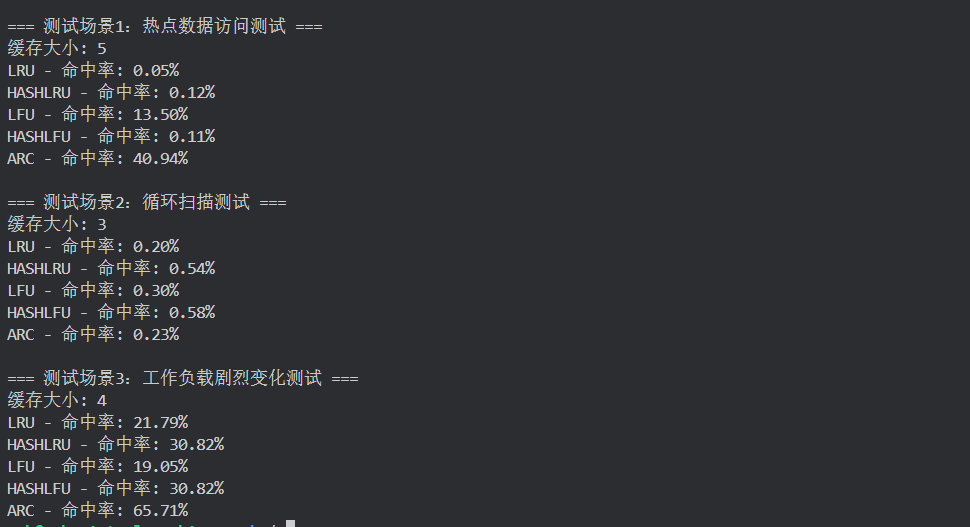
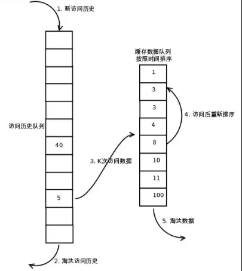
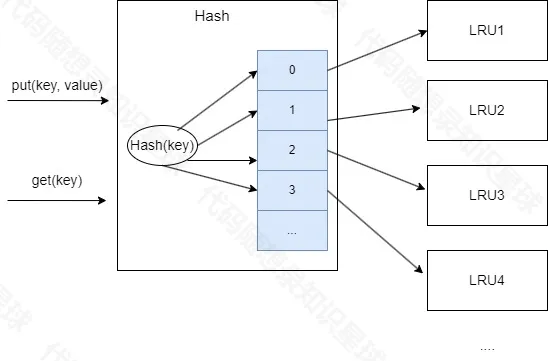
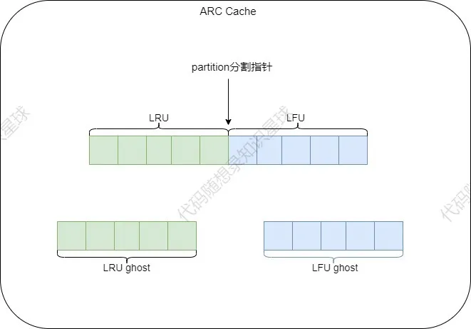
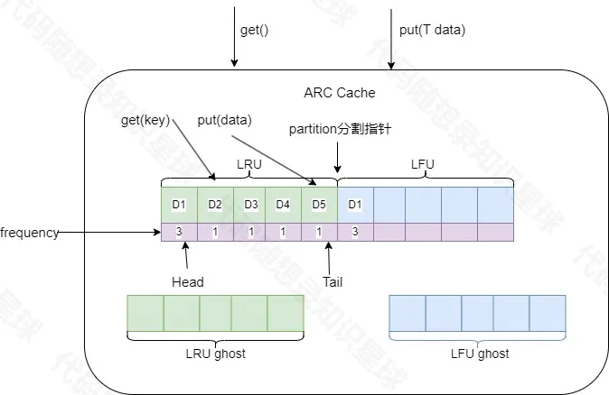
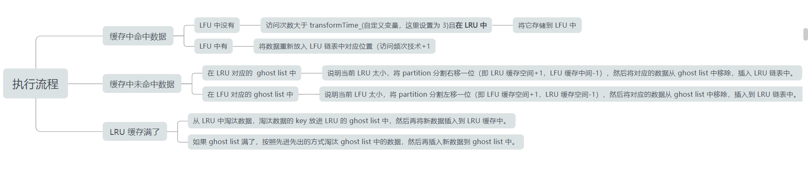

## 项目介绍

本项目使用多个页面替换策略实现一个线程安全的缓存：

- LRU：最近最久未使用
- LFU：最近不经常使用
- ARC：自适应替换

对于LRU和LFU策略，我在其基础的缓存策略上进行了相应的优化，例如：

- LRU优化：
    - LRU分片：对多线程下的高并发访问有性能上的优化
    - LRU-k：一定程度上防止热点数据被冷数据挤出容器而造成缓存污染等问题

- LFU优化：
    - LFU分片：对多线程下的高并发访问有性能上的优化
    - 引入最大平均访问频次：解决过去的热点数据最近一直没被访问，却仍占用缓存等问题

## 编译

```
mkdir build && cd build

cmake ..

make

./main
```

## 测试结果



## 缓存淘汰策略讲解
### LRU 和 LFU 的区别

LFU 是根据整个过程中数据的访问频率来决定数据的去留，而 LRU 每次淘汰的是距离现在最久没被访问的数据，不管那个数据是否访问频率高不高，只要最近它没被访问，就被淘汰。

### LRU（Least Recently Used）

最近最少使用，它的设计原则借鉴了**时间局部性原理**，该算法认为如果数据最近被访问过，那么将来被访问的几率也更高，反之亦然。其原理是将数据按照其被访问的时间形成一个有序序列，最久未被使用的数据应该最早被淘汰掉，即当缓存空间被占满时，缓存内最长时间未被使用的数据将被淘汰掉。

潜在问题：淘汰热点数据，如果有个数据在 1 个小时的前 59 分钟访问了 1 万次(可见这是个热点数据)，再后一分钟没有访问这个数据，但是有其他的数据访问，就导致了我们这个热点数据被淘汰。

#### 基础的 LRU 的缺点

- 对访问模式不敏感：如果是循环的一次性遍历大量不重复的数据（如A->B->C->D->A->B->…），LRU 可能逐步清空，几乎无法命中。
- 缓存污染：如果加载一些不再会被访问的冷数据（如一次性数据），将原有的热点数据挤出，冷数据留在缓存中，降低了缓存的利用率。
- 不适用于某些场景：在某些场景下，最近最少使用并不代表最不重要或最少需要。
- 锁的粒度大：多线程高并发的访问下，同步等待将是一笔极大的时间开销。

#### LRU-k

LRU-k 算法是对 LRU 算法的改进，基础的 LRU 算法被访问数据进入缓存队列只需要访问(`put、get`)一次就行，但是现在需要被访问 k（大小自定义）次才能被放入缓存中，基础的 LRU 算法可以看成是 LRU-1。

LRU-k 算法有两个队列一个是缓存队列，一个是数据访问历史队列。当访问一个数据时，首先将其添加进入访问历史队列并进行累加访问次数，当该数据的访问次数超过 k 次后，才将数据缓存到缓存队列，从而避免缓存队列被冷数据所污染。同时访问历史队列中的数据也不是一直保留的，也是需要按照 LRU 的规则进行淘汰的。LRU-k 执行过程如图：



一般情况下，当 k 的值越大，缓存的命中率越高，但也使得缓存难以淘汰。综合来说，k = 2  时性能最优。

#### HashLRU

线程安全的普通 LRU 中有锁的存在。每次读写操作之前都有加锁操作，完成读写操作之后还有解锁操作。在低 QPS 下，锁的竞争的耗时基本可以忽略；但在高并发的情况下，大量的时间消耗在等待锁的操作上，导致耗时增长。

针对大量同步等待操作导致耗时增加的情况，解决方案就是尽量减小临界区。引入`hash`机制，对全量数据做分片处理，在原有`LfuCache`的基础上形成`HashLfuCache`，以降低查询耗时。

`HashLfuCache`引入哈希算法，将缓存数据分散到 N 个`LfuCache`上，查询时也按照相同的哈希算法，先获取数据可能存在的分片，然后再去对应的分片上查询数据。这样可以增加 lfu 的读写操作的并行度，减少同步等待的耗时。

将 LRU 分片，就是将原来的缓存分成若干份，这样如果两份数据在不同的缓存中，就可以同时进入缓存，而不是只有等先进去的进程出来后我才能进去。具体实现结构如图：



根据传入的`key`值进行哈希运算后找到对应的`LRU`分片，然后调用该分片相应的方法。

大家试想一下当多个线程同时访问一个 LRU 时（LFU 同理），由于锁的粒度大，是不是会造成长时间的同步等待，那如果是多个线程同时访问多个 LRU 缓存呢，是不是同步等待时间大大减少了。

`HashLruCaches`和`LruCache`类是组合关系，前者依赖于后者。

注意：`LRU(LFU)`分片之后淘汰的元素就不是全局中访问最近最不经常访问的元素了(全局的`minFreq_`)，淘汰的是局部`minFreq_`，这里是可以接受的，因为可能某个分片 LRU(LFU) 中存着大量元素，下一个元素还分给这个`LRU(LFU)`分片的话，就应该将当前的`LRU(LFU)`中最近最不经常访问的元素剔除而不是全局的最近最不经常访问元素，然后将新元素添加进来。

### LFU（Least Frequently Used）

最不经常使用，它的设计原则使用了**概率思想**，该算法认为如果一个对象的被访问频率很低，那么再次被访问的概率也越低。其原理是缓存空间中被访问次数最少的数据应该最早被淘汰掉，即当缓存空间被占满时，缓存内被访问频率最少的数据将被置换走。

[参考文章](https://blog.csdn.net/saxon_li/article/details/123985667)

#### 普通 LFU 的缺点

- 频率爆炸问题：对于长期驻留在缓存中的热数据，频率计数可能会无限增长，占用额外的存储空间或导致计数溢出。
- 过时热点数据占用缓存：一些数据可能已经不再是热点数据，但因访问频率过高，难以被替换。
- 冷启动问题：刚加入缓存的项可能因为频率为 1 而很快被淘汰，即便这些项是近期访问的热门数据。
- 不适合短期热点：LFU 对长期热点数据表现较好，但对短期热点数据响应较慢，可能导致短期热点数据无法及时缓存。
- 缺乏动态适应性：固定的 LFU 策略难以适应不同的应用场景或工作负载。
- 锁的粒度大，多线程高并发访问下锁的同步等待时间过长。

#### 加上最大平均访问次数限制

在 LFU 算法之上，引入访问次数平均值概念，当平均值大于最大平均值限制时将所有结点的访问次数减去最大平均值限制的一半或者一个固定值。相当于热点数据“老化”了，这样可以避免频次计数溢出，也可以缓解缓存污染。

##### 设置最大平均访问次数的值解决了什么问题？

1. 防止某一个缓存的访问频次无限增加，而导致的计数溢出。
2. 旧的热点缓存，也就是该数据之前的访问频次很高，但是现在不再被访问了，也能够保证他在每次访问缓存平均访问次数大于最大平均访问次数的时候减去一个固定的值，使这个过去的热点缓存的访问频次逐步降到最低，然后从内存中淘汰出去
3. 一定程度上是对新加入进来的缓存，也就是访问频次为 1 的数据缓存进行了保护，因为长时间没被访问的旧的数据不再会长期占据缓存空间，访问频率会逐步被降为小于 1 最终淘汰。

#### HashLfuCache

实现类似于 HashLruCache。

### ARC

**核心思想**：当访问的数据趋向于访问 **最近的内容**，会更多地命中 LRU list，这样会增大 LRU 的空间；当系统趋向于访问 **频繁访问的内容** 时，会更多地命中 LFU list，这样会增加 LFU 的空间。

**应用场景**：主要应用于不同的访问模式(比如近期频繁访问和周期性访问交叉的场景)之间表现较好，因为他可以动态调整缓存分区的大小。

#### 解决 LRU 循环缓存问题

 **问题描述**：在 LRU 中，如果缓存中有热点数据（频繁访问的少量数据），但新的数据不断进入，可能导致热点数据被淘汰，出现缓存抖动（thrashing）。
	
**ARC 解决方案**：ARC 使用两个队列来分别跟踪最近访问（类似 LRU）和经常访问（类似 LFU）的数据，并根据访问模式动态调整这两部分缓存的大小，从而避免热点数据被过早淘汰。

#### 解决 LFU 的冷启动问题

**问题描述** ：在 LFU 中，新加入的缓存项起初频率低，可能在尚未证明其重要性时就被淘汰。

**ARC 的解决方案**：ARC 保留了一个专门存储最近访问但被淘汰的数据队列（ghost list），帮助识别新数据的价值，如果某个新数据被多次访问，可以快速将其提升为频繁访问的数据。

#### 执行过程剖析

1. 整个 Cache 分为两部分，LRU 和 LFU 各占一半，根据不同的访问模式动态适应调整 `partition` 分割指针的位置（也就是动态调整 LFU 和 LRU 的大小），除此之外，LRU 和 LFU 各自有一个 `ghost list`（淘汰链表，分别用于存储从 LRU 和 LFU 中淘汰的数据）。总体结构如图：



更加详细结构流程图如下：（ps：`ARCCache`对象的`get`方法和`put`方法实际上调用的是 LRU 和 LFU 的`get`与`put`方法。 `frequency`指的是该数据的访问频率。）



2. 在缓存中查找客户端需要访问的数据，如果没有命中，表示缓存穿透，将需要访问的数据从从磁盘中取出，从`LRU`对应链表的尾部（ps：头插和尾插没有区别，看个人习惯）。

3. 如果命中且 LFU 链表中没有则判断该数据的访问次数是否大于`transformTime_`（自定义的变量，我这里设置为 3，代表访问次数超过 3 次），若大于则将该数据插入`LFU`对应链表中（一个块至少需要读取`transformTime_`次，并且要是最近请求的数据，才会被存储到`LFU`中）。于是，该数据块不仅仅只保存在 LRU 的缓存目录中，也将保存到 LFU 中。如果命中且 LFU 链表中存在，则将数据重新放入 LFU 链表中对应位置（访问频次计数 +1），这样，那些真正被频繁访问的页面将一直呆在缓存中，不会被冷数据的加入而误淘汰，不经常访问的数据会向链表头部移动，最终被淘汰出去。

4. 如果此时`LRU`缓存满了，则从`LRU`链表中淘汰表头部的数据，将淘汰数据的`key`放入`LRU`对应的`ghost list`。然后在`LRU`的链表尾部添加新数据。如果`ghost list`的元素满了，按照先进先出的方式淘汰`ghost list`中的元素头部元素，然后再从尾部插入元素。

5. 如未命中缓存的数据根据 key 发现在 LRU 对应的`ghost list`中，则表示幽灵命中，缓存系统就可以知道，这是一个刚刚淘汰的页面，而不是第一次读取或者说很久之前读取的一个页面。于是根据这个信息来调整内部的`partition`分割指针以适应当下的访问模式。上述迹象说明当前的`LRU`缓存太小了，于是将`partition`分割指针右移一位(也就是`LRU`缓存空间 +1，`LFU`缓存空间 -1），并将命中的`key`数据从`ghost`的中移除，将新数据从 LRU 链表尾部插入。

6. 反之如果未命中缓存的数据根据 key 发现在 LFU 对应的 ghost 中，则说明当前访问模式偏向于频繁访问经常被访问的那一些数据，说明当下 LFU 缓存空间太小了，对应`partition`分割指针左移一位，并将命中的`key`数据从`ghost`的中移除，将新数据从 LRU 链表尾部插入。



在实现 ARC 的时候，虽然用到了 LFU 和 LRU ，实现部分有些相似，但是还有很多是不一样的，所以没有用上面实现，而是另外实现，如 get，put 中的方法有些不一样，如果采用原来的放上去实现 ARC，可能会很麻烦，例如上面的 LRU 和 LFU 各自用到了自己的节点，而实现 ARC 时直接用 ArcNode ，不是用各自的节点，直接统一成 ArcNode。
